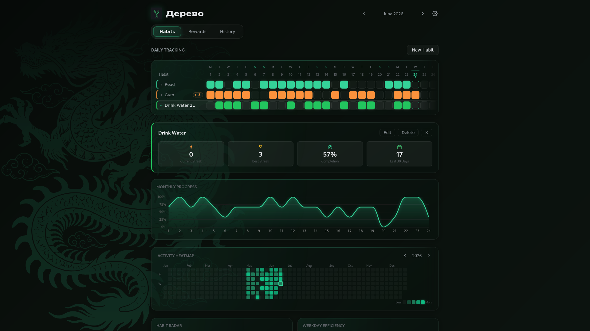

<div align="center">


<h1>DEREVO</h1>

<p><em>дерево</em> — tree. A fast, native habit tracker.</p>

</div>

---

## About

**Derevo** is a minimalist, offline-first habit tracker built with Rust and
Tauri. Track daily habits, earn streak rewards, set goals with checkpoints,
and visualize your progress — all on your device, with no accounts and no
telemetry.

## Screenshot

<div align="center">



</div>

## Features

- **Habit tracking** — daily check-in grid with streak counting
- **Heatmap** — GitHub-style activity view for the full year
- **Analytics** — weekday efficiency, monthly trends, category radar
- **Streak rewards** — define milestones with custom reward text
- **Goals** — set goals with checkpoints, auto-complete on all done
- **Achievements** — trophies for completed goals and unlocked milestones
- **Reminders** — a time of day per habit, for the ones still pending
- **Archive** — retire a habit without losing its history, and restore it later
- **Backup** — export everything to a JSON file and import it back

## Tech Stack

| Component    | Technology               |
| :----------- | :----------------------- |
| **Core**     | **Rust**                 |
| **Shell**    | **Tauri 2**              |
| **Frontend** | **Svelte 5 + TypeScript**|
| **Database** | **SQLite**               |
| **i18n**     | **Svelte store** (EN / ES)|

## Quick Start (Nix)

```bash
direnv allow                         # or: nix develop
cd ui-svelte && pnpm install && cd .. # first time only
cargo tauri dev                      # run in development mode
cargo tauri build                    # build a production binary
```

### Android

```bash
cargo tauri android dev
cargo tauri android build
```

## License

Open source under the **GNU Affero General Public License v3.0**.
See [LICENSE](LICENSE).

-----

<div align="center">
<sub>Built with Rust, Tauri, and Svelte</sub>
</div>
